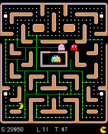

# AI-Pacman

## About AI-Pacman
This is a assignment from the subject WID3009 AI Game Programming. We are required to implement at least 2 algorithms for the AI to play Ms. Pacman. 

## Details
In our implementation, we had implemented **3** algorithms which is:
1. A* Search
2. Monte Carlo Search
3. Genetic Algorithm  

After implementing these algorithms, we had chosen **2** fitness function to evaluate our AI:
1. Score
2. Number of levels passed 

## Getting started
In order to try to run the code, you need to go to the `Main.java` in the directory.

There's three lines in the last few lines which includes:

1. A* Search
```sh
executor.runGame(new AStarSearchPacMan(ghost_in), ghosts, speed);
```
2. Monte Carlo Tree Search 
```sh
executor.runGame(new MCTS(), ghosts, speed);
```

3. Genetic Algorithm
```sh
executor.runGame(new EvolvedPacMan("bestGene.txt"), ghosts, speed);
```

You can just uncomment and run the code to whichever algorithm that you wanted to try with! Below is the screenshot of the highest score of our implementation: 




Original repo by https://github.com/solar-1992/PacManEngine.<br/>
A simple tree search controller for Ms. Pac-Man Vs Ghost Team Competition
implemented based on this paper https://www.researchgate.net/publication/221157530_A_simple_tree_search_method_for_playing_Ms_Pac-Man


